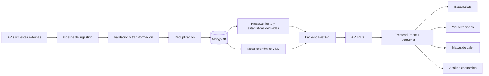

# ValoInsight

**Centro táctico y analítico para VALORANT**

ValoInsight es una plataforma web Full Stack desarrollada como **Trabajo de Fin de Grado en Ingeniería Informática en la Universidad de Córdoba**.

El proyecto centraliza, procesa y analiza información de partidas y jugadores de VALORANT con el objetivo de transformar datos de juego en **estadísticas, visualizaciones y herramientas de apoyo al análisis**.

La aplicación combina un frontend desarrollado con **React y TypeScript**, un backend basado en **Python y FastAPI**, persistencia mediante **MongoDB** y diferentes procesos de ingestión, transformación y análisis de datos.

Además, incorpora un sistema experimental de **análisis y recomendación económica** que combina reglas deterministas con técnicas de Machine Learning.

---

## Características principales

### Análisis de jugadores

* Consulta de estadísticas asociadas a jugadores.
* Procesamiento de información procedente de sus partidas.
* Cálculo de métricas y estadísticas derivadas.
* Visualización interactiva de resultados.
* Representación espacial de información mediante mapas de calor.

### Estadísticas globales

* Análisis agregado de la información almacenada.
* Comparación de métricas de rendimiento.
* Estadísticas relacionadas con agentes, mapas y otros elementos del juego.
* Representación gráfica mediante componentes interactivos.

### Análisis de partidas

* Procesamiento de datos detallados de las partidas.
* Validación de eventos y datos recibidos.
* Reconstrucción de información relevante para el análisis.
* Tratamiento de estadísticas de combate y rendimiento.
* Análisis del comportamiento económico por ronda.

### Análisis económico

ValoInsight incorpora un motor específico para estudiar la economía de las partidas.

El sistema:

* reconstruye el estado económico de los jugadores;
* distingue entre equipamiento comprado, conservado o recibido mediante *drop*;
* genera alternativas de compra válidas;
* tiene en cuenta créditos, armadura, armas, habilidades e inventario;
* analiza el contexto de rondas anteriores;
* evalúa diferentes planes económicos;
* proporciona recomendaciones manteniendo las reglas del juego como fuente autoritativa.

La lógica económica se ha diseñado siguiendo un enfoque **rules-first**: las reglas deterministas controlan siempre la legalidad de una compra y el Machine Learning actúa únicamente como una señal auxiliar.

### Machine Learning aplicado a economía

El proyecto incluye un módulo experimental de Machine Learning orientado al análisis económico.

Entre sus características se encuentran:

* construcción de datasets a partir de datos históricos;
* separación entre estado previo a la compra, acción realizada y resultado;
* modelos de clasificación para estimar resultados de ronda;
* validación temporal;
* prevención de *data leakage*;
* calibración de probabilidades;
* evaluación mediante diferentes métricas;
* comparación de políticas;
* posibilidad de abstención cuando el modelo no dispone de evidencia suficiente.

El modelo nunca puede convertir una compra ilegal en válida: las reglas del sistema mantienen siempre la prioridad sobre las predicciones.

### Información del juego

La plataforma también proporciona secciones específicas para consultar información relacionada con:

* agentes;
* armas;
* mapas;
* actos;
* eventos;
* modos de juego;
* cosméticos;
* estadísticas globales.

---

## Arquitectura

ValoInsight utiliza una arquitectura separada entre frontend, backend, persistencia y procesos de tratamiento de datos.



La separación entre frontend y backend permite mantener desacoplada la interfaz de usuario de la lógica de negocio y del procesamiento de datos.

---

## Stack tecnológico

### Frontend

* **React**
* **TypeScript**
* **Vite**
* **React Router**
* **TanStack React Query**
* **Recharts**
* **Tailwind CSS**
* **Vitest**
* HTML
* CSS

### Backend

* **Python**
* **FastAPI**
* **Pydantic**
* APIs REST
* Uvicorn

### Datos

* **MongoDB**
* **PyMongo**
* **pandas**
* **NumPy**

### Machine Learning y análisis

* **scikit-learn**
* **SciPy**
* pandas
* NumPy
* procesamiento estadístico
* validación temporal
* calibración y evaluación de modelos

### Testing

* **Vitest** en frontend.
* Pruebas automatizadas en backend para APIs, procesamiento de eventos, economía, atribución de daño, ML y otros componentes del sistema.

---

## Arquitectura del backend

El backend se encuentra dividido en módulos funcionales para reducir el acoplamiento entre las diferentes responsabilidades de la aplicación.

Entre los principales módulos se encuentran:

```text
backend/
├── modules/
│   ├── analytics/
│   ├── auth/
│   ├── content/
│   ├── economy_ml/
│   ├── leaderboards/
│   ├── matches/
│   ├── players/
│   ├── regions/
│   └── users/
├── tests/
├── db/
└── main.py
```

Esta organización permite separar funcionalidades como:

* estadísticas y analítica;
* autenticación;
* contenido del juego;
* economía y Machine Learning;
* partidas;
* jugadores;
* regiones;
* usuarios.

---

## Arquitectura del frontend

El frontend está desarrollado como una aplicación React independiente y utiliza enrutamiento para separar las diferentes áreas funcionales.

```text
frontend/
├── src/
│   ├── api/
│   ├── components/
│   ├── constants/
│   ├── context/
│   ├── hooks/
│   ├── pages/
│   ├── types/
│   ├── utils/
│   ├── App.tsx
│   └── main.tsx
├── package.json
└── vite.config.*
```

Entre las principales vistas disponibles se encuentran:

```text
/
├── agentes
├── armas
├── mapas
├── actos
├── eventos
├── modos
├── informacion
├── estadisticas-globales
├── estadisticas/:playerId
├── estadisticas/:playerId/heatmap
└── cosmeticos/
```

Las páginas se cargan mediante **lazy loading**, reduciendo la carga inicial de la aplicación.

---

## Pipeline de datos

Uno de los componentes principales de ValoInsight es el proceso encargado de preparar la información utilizada por la plataforma.

De forma simplificada:

```text
Obtención de partidas
        ↓
Comprobación de datos existentes
        ↓
Descarga de nueva información
        ↓
Validación
        ↓
Transformación al modelo interno
        ↓
Detección y eliminación de duplicados
        ↓
Inserción en MongoDB
        ↓
Reconstrucción de estadísticas derivadas
        ↓
Verificación de integridad
```

El pipeline permite realizar diferentes operaciones de forma automatizada y dispone de opciones para controlar el número de partidas, jugadores procesados, almacenamiento y verificaciones finales.

### Ejecución recomendada

```bash
python scripts/pipeline_partidas.py \
    --matches-per-player 5 \
    --fill-requested \
    --delete-duplicates
```

### Verificación final de integridad

```bash
python scripts/pipeline_partidas.py \
    --matches-per-player 5 \
    --fill-requested \
    --delete-duplicates \
    --verify \
    --expected-per-player 405
```

---

## Sistema de economía y Machine Learning

El módulo `economy_ml` constituye una de las partes más experimentales del proyecto.

Su objetivo es analizar el estado económico de una ronda y generar recomendaciones de compra teniendo en cuenta tanto las restricciones del juego como el contexto disponible.

El sistema diferencia claramente entre:

### Reglas deterministas

Responsables de:

* comprobar la legalidad de las compras;
* reconstruir inventarios;
* gestionar armas conservadas;
* gestionar *drops*;
* calcular costes;
* tratar armadura y habilidades;
* reconstruir créditos;
* generar alternativas de compra.

### Contexto

Puede incorporar información como:

* mapa;
* tendencias anteriores de la partida;
* comportamiento del jugador;
* economía estimada del rival;
* ultimates;
* armadura;
* habilidades;
* estado de rondas anteriores.

### Machine Learning

Actúa como una señal adicional para evaluar determinadas alternativas.

El sistema utiliza mecanismos específicos para evitar utilizar información de la ronda que todavía no estaría disponible en el momento de tomar la decisión.

Por ejemplo, para recomendar una compra de la ronda `N` no se utilizan como características:

* kills producidas durante la propia ronda `N`;
* daño de la ronda actual;
* resultado de la ronda;
* plant o defuse posteriores;
* marcador posterior a la ronda;
* información de compra rival observada después de realizarse.

De esta forma se evita introducir información futura en el proceso de entrenamiento o inferencia.

---

## API

El backend expone la funcionalidad de ValoInsight mediante una **API REST desarrollada con FastAPI**.

Frontend y backend están completamente separados.

Durante el desarrollo local:

```text
Frontend: http://localhost:5173
Backend:  http://localhost:8000
```

La dirección utilizada por el frontend puede configurarse mediante:

```env
VITE_API_BASE_URL=http://localhost:8000
```

Los orígenes permitidos por el backend pueden configurarse mediante:

```env
CORS_ORIGINS=http://localhost:5173
```

---

## Instalación y ejecución

### Requisitos

Es necesario disponer de:

* Python
* Node.js y npm
* MongoDB o acceso a una instancia MongoDB
* Git

Algunas funcionalidades de obtención de datos requieren además las claves de las APIs externas utilizadas por el proyecto.

---

### 1. Clonar el repositorio

```bash
git clone https://github.com/Dani93414/ValoInsight_Centro-tactico-y-analitico-para-VALORANT.git
cd ValoInsight_Centro-tactico-y-analitico-para-VALORANT
```

---

### 2. Configurar las variables de entorno

El repositorio incluye un archivo:

```text
.env.example
```

Crea tu propia configuración a partir de él.

Las principales variables disponibles son:

```env
DB_URI=
DB_NAME=

RIOT_API_KEY=
HENRY_API_KEY=

HENRIK_REQUESTS_PER_MINUTE=60
HENRIK_RATE_LIMIT_SAFETY_FACTOR=1.10
HENRIK_DOWNLOAD_WORKERS=4

IMAGE_DOWNLOAD_WORKERS=8
MATCH_CONVERT_WORKERS=4
MONGO_UPLOAD_WORKERS=6

JWT_SECRET_KEY=
JWT_EXPIRES_MINUTES=1440
AUTH_COOKIE_SECURE=false

CORS_ORIGINS=http://localhost:5173
VITE_API_BASE_URL=http://localhost:8000
```

> No subas claves API, secretos JWT ni credenciales de bases de datos al repositorio.

---

### 3. Instalar y ejecutar el backend

```bash
cd backend
```

Crea un entorno virtual:

#### Windows

```bash
python -m venv venv
venv\Scripts\activate
```

#### Linux/macOS

```bash
python3 -m venv venv
source venv/bin/activate
```

Instala las dependencias:

```bash
pip install -r requirements.txt
```

Ejecuta el backend:

```bash
python main.py
```

El servidor estará disponible por defecto en:

```text
http://localhost:8000
```

---

### 4. Instalar y ejecutar el frontend

Desde la raíz del repositorio:

```bash
cd frontend
npm install
npm run dev
```

La aplicación estará disponible por defecto en:

```text
http://localhost:5173
```

---

## Scripts disponibles en el frontend

### Desarrollo

```bash
npm run dev
```

### Compilación

```bash
npm run build
```

### Lint

```bash
npm run lint
```

### Tests

```bash
npm run test
```

### Preview de producción

```bash
npm run preview
```

---

## Testing

ValoInsight incorpora pruebas automatizadas para diferentes componentes del sistema.

El backend dispone de pruebas relacionadas con áreas como:

* endpoints de la API;
* validación de eventos de combate;
* atribución de daño;
* reconstrucción económica;
* inventarios;
* caché de partidas;
* recomendaciones económicas;
* Machine Learning;
* consistencia de datos.

El frontend utiliza **Vitest** para sus pruebas.

La presencia de tests resulta especialmente importante en módulos como el sistema económico, donde las reglas de inventario, créditos y compras deben mantenerse consistentes incluso ante datos incompletos.

---

## Estructura general del repositorio

```text
ValoInsight/
├── backend/
│   ├── modules/
│   ├── tests/
│   ├── db/
│   ├── requirements.txt
│   └── main.py
│
├── frontend/
│   ├── src/
│   ├── package.json
│   └── ...
│
├── scripts/
│   └── pipeline_partidas.py
│
├── .env.example
└── README.md
```

---

## Decisiones de diseño

### Separación frontend/backend

Frontend y backend funcionan como aplicaciones independientes comunicadas mediante APIs REST.

Esto permite:

* reducir el acoplamiento;
* mantener responsabilidades diferenciadas;
* configurar independientemente cada entorno;
* facilitar una futura estrategia de despliegue separada.

### MongoDB

MongoDB se utiliza como sistema de persistencia principal para almacenar información procedente de partidas y otros datos procesados por la plataforma.

### React Query

TanStack React Query se utiliza para gestionar el acceso a los datos del backend desde el frontend y facilitar aspectos como consultas, estados de carga y caché.

### Arquitectura económica rules-first

Las recomendaciones económicas no dependen exclusivamente de un modelo de Machine Learning.

Las reglas del dominio tienen prioridad sobre el modelo, evitando que una predicción pueda producir una recomendación incompatible con las restricciones económicas de VALORANT.

---

## Limitaciones

ValoInsight es un proyecto académico y algunas de sus funcionalidades dependen de la calidad y disponibilidad de los datos obtenidos mediante APIs externas.

Entre las principales limitaciones se encuentran:

* determinados datos pueden no estar disponibles directamente;
* parte del estado económico debe reconstruirse mediante reglas;
* la compra exacta de determinadas habilidades puede no ser completamente observable;
* algunos eventos pueden requerir inferencias conservadoras;
* los modelos de Machine Learning se utilizan como apoyo y no como sistemas causales;
* los artefactos ML incluidos en el proyecto tienen finalidad académica y demostrativa;
* la precisión de determinadas métricas depende de la información proporcionada por las fuentes externas.

El sistema está diseñado para degradar de forma controlada cuando una determinada fuente de información no está disponible, evitando que la ausencia de una señal secundaria bloquee completamente el análisis.

---

## Estado del proyecto

ValoInsight se encuentra desarrollado como **Trabajo de Fin de Grado** y continúa en proceso de mejora y documentación.

### Próximas mejoras técnicas

Entre las posibles evoluciones del proyecto se encuentran:

* [ ] despliegue público de la aplicación;
* [ ] Dockerización de frontend y backend;
* [ ] Docker Compose para el entorno completo;
* [ ] integración continua mediante GitHub Actions;
* [ ] ampliación de cobertura de pruebas;
* [ ] mejora de documentación de la API;
* [ ] optimización del pipeline de datos;
* [ ] incorporación de nuevas métricas y visualizaciones.

> Esta sección representa trabajo futuro y no funcionalidades implementadas actualmente.

---

## Demo

Actualmente no existe una demo pública permanente.

Cuando esté disponible se añadirá aquí:

**Demo online:** Próximamente.

---

## Trabajo de Fin de Grado

ValoInsight ha sido desarrollado como **Trabajo de Fin de Grado del Grado en Ingeniería Informática de la Universidad de Córdoba**.

El proyecto busca aplicar de forma conjunta conocimientos de:

* Ingeniería del Software.
* Desarrollo Full Stack.
* Diseño y consumo de APIs.
* Bases de datos.
* Procesamiento de datos.
* Análisis estadístico.
* Visualización de datos.
* Machine Learning.
* Algoritmos.
* Testing y validación de software.

---

## Autor

**Daniel Grande Rubio**

Grado en Ingeniería Informática
Mención en Computación
Universidad de Córdoba

GitHub: [@Dani93414](https://github.com/Dani93414)

---

## Aviso

ValoInsight es un **proyecto académico independiente**.

VALORANT y todos los elementos relacionados con el juego son propiedad de **Riot Games**. Este proyecto no está afiliado, respaldado ni patrocinado por Riot Games.

El uso de información y recursos relacionados con VALORANT se realiza exclusivamente con fines académicos, educativos y demostrativos.
